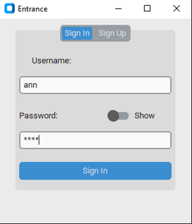
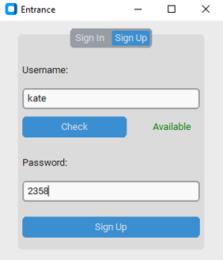
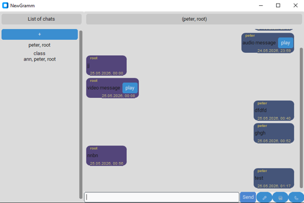
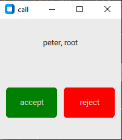
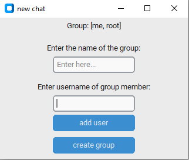

# NewGramm - Cross-Platform Messenger

## 📖 About the Project

**NewGramm** is a multifunctional messenger developed in **Python** using an **asynchronous** architecture. The application allows users to exchange text, audio, and video messages, create personal and group chats, and make real-time audio calls.

The project demonstrates the practical application of client-server architecture, asynchronous programming, the WebSocket protocol for real-time data transmission, and multimedia technologies.

---

## 🎯 Features

| Feature | Description |
|---------|-------------|
| **Registration & Authentication** | Create an account with username uniqueness check, **JWT**-based login |
| **Personal & Group Chats** | Create chats with one or multiple participants |
| **Text Messages** | Send and receive text in real time |
| **Audio Messages** | Record from microphone and send audio files |
| **Video Messages** | Record from webcam with audio-video synchronization |
| **Audio Calls** | Real-time voice communication via **WebSocket** |
| **Message History** | All messages stored in **MySQL** database |

---

## 🛠️ Technologies Used

### Programming Language
- **Python 3.10+** — primary development language with asynchronous programming support

### Server Side (FastAPI)

| Component | Technology | Purpose |
|-----------|------------|---------|
| **Web Framework** | FastAPI | Create **REST API** and **WebSocket** server with automatic documentation |
| **ASGI Server** | Uvicorn | High-performance ASGI server for running the application |
| **Database** | MySQL + aiomysql | Asynchronous storage of users, chats, and messages |
| **Authentication** | PyJWT | JWT token generation and verification |
| **Hashing** | hashlib + secrets | Secure password storage with salt |
| **HTTP Protocol** | — | REST API for registration, sending messages, retrieving history |
| **WebSocket Protocol** | websockets (Python) | Bidirectional real-time audio data transmission |
| **Server-Sent Events (SSE)** | StreamingResponse | Notifications for new messages and calls |

### Client Side

| Component | Technology | Purpose |
|-----------|------------|---------|
| **GUI Framework** | CustomTkinter | Modern adaptive interface with themes |
| **Async HTTP Client** | HTTPX | Non-blocking server requests |
| **WebSocket Client** | websockets (Python) | Call connectivity |
| **Asynchronous Runtime** | asyncio | Parallel execution of network operations and UI work |
| **Integration** | async_tkinter_loop | Combining asyncio and Tkinter in one event loop |

### Multimedia Technologies

| Component | Technology | Purpose |
|-----------|------------|---------|
| **Audio Capture** | SoundDevice | Microphone recording and playback |
| **Audio Processing** | NumPy + SciPy | Audio data handling, compression/decompression |
| **Video Capture** | OpenCV (cv2) | Real-time webcam video recording |
| **Video Editing** | MoviePy | Audio and video stream synchronization and merging |
| **Video Playback** | python-vlc | Built-in video message playback |
| **Audio Compression** | zlib | Audio data compression for WebSocket transmission |

---

## 📊 Class Diagram

<div align="center">
  <table>
    <tr>
      <th>Class</th>
      <th>Purpose</th>
      <th>Main Methods</th>
    </tr>
    <tr>
      <td><code>App</code></td>
      <td>Main application window</td>
      <td><code>on_text_send()</code>, <code>on_audio_click()</code>, <code>on_video_click()</code>, <code>on_call()</code></td>
    </tr>
    <tr>
      <td><code>Entrance</code></td>
      <td>Authentication window</td>
      <td><code>login()</code>, <code>reg()</code>, <code>on_success()</code></td>
    </tr>
    <tr>
      <td><code>Data</code></td>
      <td>Data and network management</td>
      <td><code>send_message()</code>, <code>get_chats()</code>, <code>get_updates()</code>, <code>create_chat()</code></td>
    </tr>
    <tr>
      <td><code>ObservableList</code></td>
      <td>List with change notifications</td>
      <td><code>append()</code>, <code>set_callback()</code></td>
    </tr>
    <tr>
      <td><code>ChatListFrame</code></td>
      <td>Chat list panel</td>
      <td><code>update()</code>, <code>clear()</code></td>
    </tr>
    <tr>
      <td><code>ChatFrame</code></td>
      <td>Message history panel</td>
      <td><code>update()</code>, <code>clear()</code></td>
    </tr>
    <tr>
      <td><code>CallWindow</code></td>
      <td>Audio call window</td>
      <td><code>on_accept()</code>, <code>on_reject()</code>, <code>on_close()</code></td>
    </tr>
    <tr>
      <td><code>VideoWindow</code></td>
      <td>Video playback window</td>
      <td><code>on_close()</code>, <code>check_video_end()</code></td>
    </tr>
  </table>
</div>

---

## 🏗️ System Architecture

The project is built on a **client-server** model with a centralized server.

### Server Side (server.py)

```
┌──────────────────────────────────────────────────────────┐
│                      FastAPI Server                      │
├──────────────────────────────────────────────────────────┤
│  HTTP Endpoints           │  WebSocket Handler           │
│  - /sign_in              │  - /call (audio calls)        │
│  - /registration         │                               │
│  - /new_chat             │  SSE Generator                │
│  - /new_message          │  - /event_stream              │
│  - /chat_list            │                               │
│  - /chat_messages        │  Database Module              │
│  - /message_file         │  - aiomysql + MySQL           │
└──────────────────────────────────────────────────────────┘
```

### Client Side (client.py)

```
┌────────────────────────────────────────────────────────────┐
│                    GUI (CustomTkinter)                     │
├────────────────────────────────────────────────────────────┤
│  App              ChatListFrame      ChatFrame             │
│  ├── Navigation   ├── Chat list     ├── History            │
│  ├── Input        ├── "+" button    ├── MessageFrame       │
│  ├── Buttons      └── ObservableList└── ObservableList     │
│  └── Panels                                                │
├────────────────────────────────────────────────────────────┤
│                    Data Layer (client_data.py)             │
│  ┌─────────────────────────────────────────────────────┐   │
│  │  HTTPX Client  │  SSE Client  │  WebSocket Client   │   │
│  └─────────────────────────────────────────────────────┘   │
├────────────────────────────────────────────────────────────┤
│              Multimedia Layer (work_with_audio_video.py)   │
│  ┌───────────┐  ┌───────────┐  ┌──────────────────────┐    │
│  │SoundDevice│  │  OpenCV   │  │  MoviePy + VLC       │    │
│  │ (audio)   │  │ (video)   │  │ (editing/player)     │    │
│  └───────────┘  └───────────┘  └──────────────────────┘    │
└────────────────────────────────────────────────────────────┘
```

---

## 💡 Key Implementation Features

### 1. Asynchronous Architecture
All network logic is built on `asyncio`, enabling:
- Non-blocking GUI during requests
- Handling multiple simultaneous connections on the server
- Parallel audio and video recording when creating video messages

### 2. JWT Authentication
- Token generated on login containing `user_id`, `username`, and expiration time
- All protected endpoints verify token validity
- Passwords stored hashed with salt (SHA-256)

### 3. Real-time Updates (SSE)
- Each new message is instantly delivered to all chat participants
- Incoming call notifications arrive in real time
- Asynchronous queue per connection

### 4. Audio Calls via WebSocket
- Connection establishment with audio stream routing
- Compressed audio data transmission (zlib) at 44100 Hz
- Automatic termination on connection break

### 5. Multimedia Messages
- **Audio**: Microphone recording, WAV saving, server upload
- **Video**: Parallel video (OpenCV) and audio (SoundDevice) recording, synchronization and merging (MoviePy)

### 6. ObservableList
- Observer pattern for automatic UI updates
- Callback triggered on chat list or message list changes

---

## 🖥️ Program Interface

### Authentication Window

<div align="center">
  <table>
    <tr>
      <td></td>
      <td></td>
    </tr>
    <tr>
      <td align="center"><em>Sign In to existing account</em></td>
      <td align="center"><em>Sign Up for new user</em></td>
    </tr>
  </table>
</div>

### Main Messenger Window

<div align="center">
  
  <p><em>Main window with chat list, message history and control panel</em></p>
</div>

### Call Window

<div align="center">
  
  <p><em>Incoming call (Accept/Reject buttons)</em></p>
</div>

### Video Playback Window

<div align="center">
  
  <p><em>Video message playback via VLC</em></p>
</div>

### Create Chat Window

<div align="center">
  
  <p><em>Creating a group chat with participant addition</em></p>
</div>

---

## 🚀 Installation and Running

### Server and Database Setup

Before running the server, you need to create the database. The SQL script for database creation is located in the **`create_database_script/creation.sql`** folder.
And also update the database connection settings in `server.py`:

```python
DB_CONFIG = {
    'host': 'localhost',
    'user': 'your_username',      # Change to your MySQL username
    'password': 'your_password',  # Change to your MySQL password
    'db': 'messenger_db',
    'cursorclass': aiomysql.cursors.DictCursor
}
```

### Starting the Client

File `server_addr.txt` must be in the client directory with the relevant server address

### Project Structure

```
NewGramm/
├── create_database_script/          # Database setup
│   └── messenger_db.sql             # SQL script for creating tables
├── images/                          # Screenshots for documentation
├── downloads/                       # Downloaded files (created automatically)
├── storage/                         # Server file storage (created automatically)
├── server.py                        # FastAPI server implementation
├── work_with_db.py                  # Database interaction module
├── client.py                        # Main client application
├── client_data.py                   # Data and network management
├── work_with_audio_video.py         # Multimedia processing
├── entrance.py                      # Authentication window
└── server_addr.txt                  # Server address for client (create manually)
```
